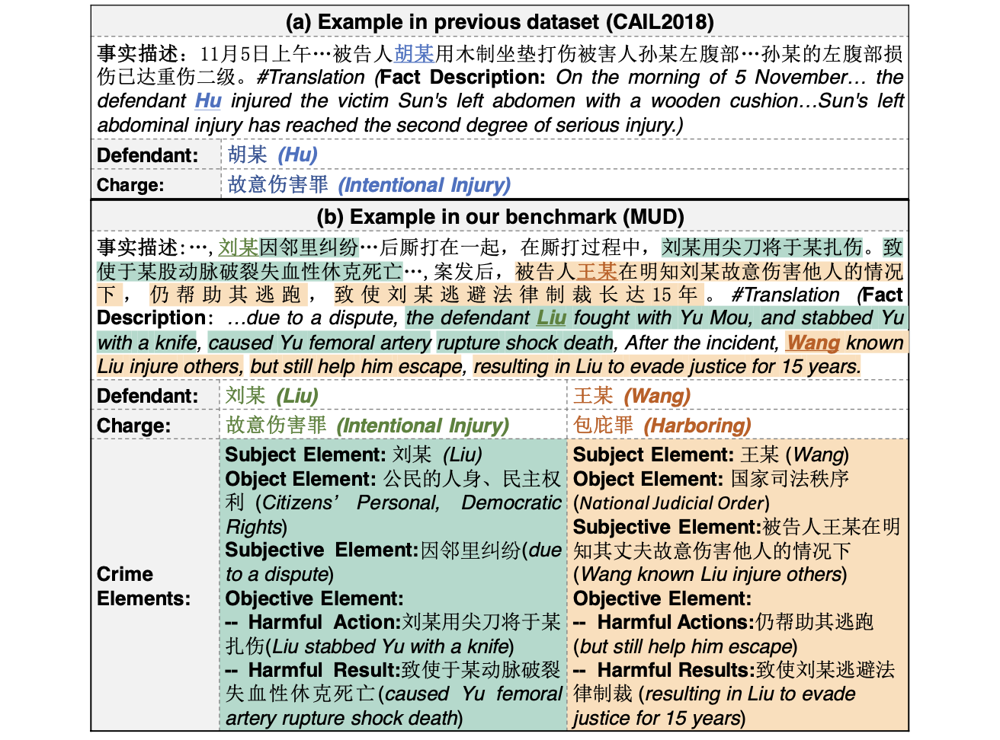
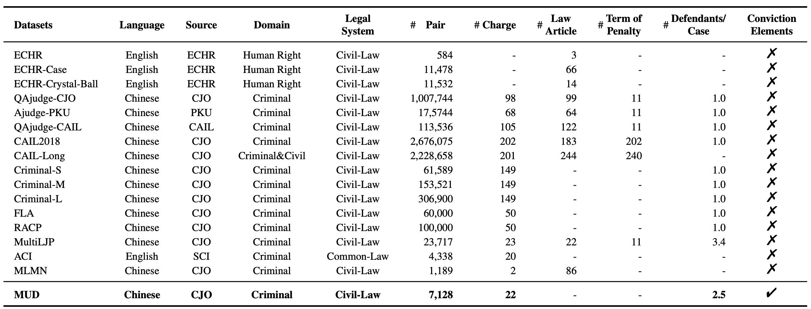
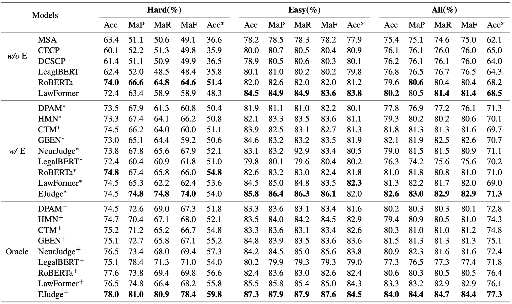

# Crime-Element-Informed Multi-Defendant Charge Prediction: Dataset and Modeling


## Overview
The charge prediction task aims to automatically recommend charges for each defendant given a fact description. We introduce a new dataset (named MELEE) containing multi-defendant legal cases with criminal elements annotations. Furthermore, based on MELEE, we propose a model named EJudge. It predicts charges by using extracted criminal elements while following legal rules, which provide a clear and justifiable rationale.


<!--  -->

## Dataset
Our dataset MELEE considers multi-defendant legal case and we annotate four types of criminal element for each defendant.

### Multiple Defendant
Our dataset MELEE comprises 2865 legal cases with an average of 2.5 defendants per case. Here is a comparison between the MELEE and other datasets. 




### Annotation Example
We ask three legal experts to annotate four types of criminal element for each defendant. Here is an annotation example.


### Annotation Scale

As far as we know, our dataset MELEE provides the largest fine-grained annotation scale for the charge prediction task.Here is a comparison between the MELEE and other datasets with fine-grained annotation. 


### Data Formmat
```
{
    "uid": "annotator-1", 
    "id": "2759711", 
    "facts": "经审理查明，被害人...", 
    "labels": [
        {
            "subject": "杨华", 
            "charge": "抢劫罪", 
            "sub+ob": [
                {
                    "object": "公民财产权利", 
                    "subjective": "为获取钱财...", 
                    "objective": {
                        "act": "...采用殴打、辱骂、持刀威..，", 
                        "res": "...人民币55999元"}
                }
            ]
        },
        {
            "subject": "左贵云", 
            "charge": "非法拘禁罪", 
            "sub+ob": [
                {
                    "object": "公民的人身、民主权利", 
                    "subjective": "为泄愤...", 
                    "objective": {
                        "act": "...人身控制", 
                        "res": "无"}
                }
            ]
        }
    ]
}
```

## Experiments

### Our Method
We propose a crime-element-informed charge prediction model named EJudge which consists of four components: the Element Selector, the Category Selector, the Rule Selector, and the Verifier.


### Baselines
We implement eleven competitive Baselines：[DPAM](https://www.yongfeng.me/attach/wang-sigir18.pdf),[MSA](https://link.springer.com/chapter/10.1007/978-981-15-1377-0_59),
[CECP](https://www.ijcai.org/proceedings/2022/0627.pdf),[DCSCP](https://link.springer.com/article/10.1007/s11280-021-00873-8),[HMN](https://dl.acm.org/doi/abs/10.1145/3331184.3331223),[NeurJudge](https://dl.acm.org/doi/abs/10.1145/3404835.3462826),[CTM]([./Baselines](https://aclanthology.org/2022.coling-1.235/)),[Chinese RoBERTa](https://ieeexplore.ieee.org/abstract/document/9599397),[LegalBERT](https://doi.org/10.18653/v1/2020.findings-emnlp.261),[LawFormer](https://aclanthology.org/2020.coling-main.88/)

### Training Configurations
Moreover, we provide three different training configurations: 

1) Without elements (*w/o* E). We develop models predicting the charge with only the given fact and the defendant's name. 

2) With extracted elements (*w/* E).} We develop models predicting the charge with extracted criminal elements. We mark models developed with this configuration with the symbol "*"

3) With annotated elements (Oracle). We develop models predicting the charge with annotated criminal elements. We mark models trained using this configuration with the symbol "+".
   

### Prefomance
The performance of Baselines and our model EJudge are as follows.


### Evaluation on CAIL2018
We further evalute our model EJudge on the commonly used dataset [CAIL2018](https://arxiv.org/abs/1807.02478).


